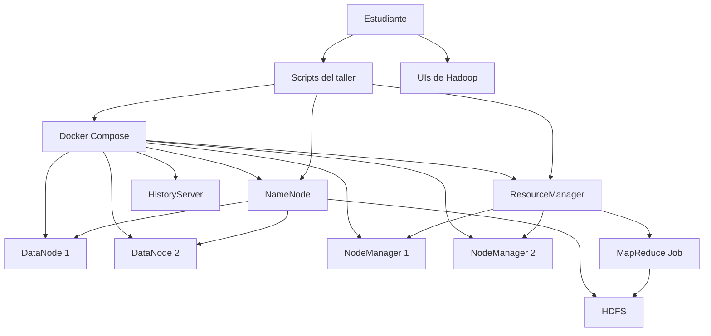

# Taller Hadoop Architecture Document

## Introduction

Este documento define la arquitectura del laboratorio práctico de Hadoop para el curso de sistemas intensivos en datos. El objetivo es mantener una base reproducible, fácil de operar en clase y suficientemente cercana a un cluster real para que los estudiantes entiendan HDFS, YARN y MapReduce.

### Starter Template or Existing Project

N/A. El taller se construye desde cero, pero la estructura documental toma como referencia los templates de `agent-ops-copilot-demo/.bmad-core/templates`.

### Change Log

| Date | Version | Description | Author |
| --- | --- | --- | --- |
| 2026-03-19 | 1.0 | Version inicial del laboratorio | Codex |

## High Level Architecture

### Technical Summary

La solucion usa un cluster Hadoop distribuido en Docker Compose con servicios separados para NameNode, DataNodes, ResourceManager, NodeManagers y HistoryServer. Los estudiantes interactuan con el cluster mediante scripts de shell, interfaz web y comandos HDFS. El job de `wordcount` se ejecuta como un proceso MapReduce batch sobre YARN, con datos almacenados previamente en HDFS. La arquitectura prioriza simplicidad operativa y visibilidad pedagogica sobre fidelidad completa a un entorno productivo.

### High Level Overview

- **Estilo arquitectonico:** laboratorio distribuido autocontenido
- **Estructura del repositorio:** monorepo simple
- **Arquitectura de servicios:** cluster Hadoop con almacenamiento y procesamiento desacoplados
- **Flujo principal:** archivo local -> HDFS -> job MapReduce -> salida en HDFS -> inspeccion por terminal o UI
- **Decisiones clave:** uso de dataset pequeño, scripts idempotentes y `wordcount` del jar oficial

### High Level Project Diagram

### Architectural and Design Patterns

- **Infraestructura efimera con contenedores:** permite reiniciar el laboratorio rapidamente y evita instalaciones manuales complejas.
- **Automatizacion por scripts:** encapsula secuencias repetitivas de HDFS y ejecucion de jobs para reducir errores de operacion.
- **Datos y computo desacoplados:** refleja el modelo central del ecosistema Hadoop y facilita explicacion de responsabilidades.

## Tech Stack

### Cloud Infrastructure

- **Provider:** local
- **Key Services:** Docker Compose, imagenes Hadoop
- **Deployment Regions:** no aplica

### Technology Stack Table

| Category | Technology | Version | Purpose | Rationale |
| --- | --- | --- | --- | --- |
| Runtime | Docker Engine / Docker Desktop | 24+ recomendado | Ejecutar el cluster | Disponible en laboratorio y equipos personales |
| Orquestacion local | Docker Compose | v2 | Definir y levantar servicios | Simplicidad y reproducibilidad |
| Hadoop | Apache Hadoop via imagenes BDE | 3.2.1 | HDFS, YARN y MapReduce | Suficiente para un primer taller |
| Shell | Bash | POSIX compatible | Automatizacion del laboratorio | Bajo costo de entrada |
| Dataset | Archivos TXT pequenos | N/A | Entrada para `wordcount` | Facil inspeccion manual |

## Components

### NameNode

**Responsibility:** administrar metadatos, namespace y ubicacion de bloques en HDFS.

**Key Interfaces:**

- Web UI en puerto `9870`
- RPC de HDFS en puerto `9000`

**Dependencies:** DataNodes

**Technology Stack:** servicio Hadoop dedicado en contenedor

### DataNodes

**Responsibility:** almacenar fisicamente bloques de datos y servir operaciones de lectura/escritura.

**Key Interfaces:**

- Registro con NameNode
- Almacenamiento distribuido de bloques

**Dependencies:** NameNode

**Technology Stack:** dos servicios Hadoop para exponer replicacion basica

### ResourceManager

**Responsibility:** coordinar recursos y planificacion de jobs YARN.

**Key Interfaces:**

- Web UI en puerto `8088`
- Scheduling de aplicaciones batch

**Dependencies:** NameNode, NodeManagers

**Technology Stack:** servicio YARN dedicado

### NodeManagers

**Responsibility:** ejecutar tareas map y reduce dentro del cluster.

**Key Interfaces:**

- Registro con ResourceManager
- Ejecucion local de contenedores de tarea

**Dependencies:** ResourceManager

**Technology Stack:** dos servicios para paralelismo visible

### HistoryServer

**Responsibility:** exponer historico de jobs para revision posterior.

**Key Interfaces:**

- Web UI en puerto `19888`

**Dependencies:** ResourceManager, NameNode

**Technology Stack:** servicio Hadoop para observabilidad basica del taller

## Data Flow

1. Los textos de ejemplo viven en `data/wordcount/`.
2. `bootstrap-hdfs.sh` carga esos archivos al directorio HDFS del laboratorio.
3. `run-wordcount.sh` invoca el jar oficial de ejemplos de Hadoop.
4. YARN asigna recursos y distribuye tareas entre NodeManagers.
5. La salida se escribe en HDFS y luego se inspecciona desde terminal.

## Operational Model

- El cluster se levanta con `make up`.
- La preparacion del dataset se hace con `make hdfs-init`.
- El laboratorio principal se ejecuta con `make wordcount`.
- La limpieza total se hace con `make clean`.

## Pedagogical Rationale

- Dos DataNodes permiten mostrar replicacion sin sobredimensionar el entorno.
- El uso del jar oficial evita desviar la sesion hacia compilacion Java.
- Los scripts son idempotentes para facilitar repeticion durante clase.

## Risks

- Si Docker no tiene memoria suficiente, YARN puede tardar en iniciar.
- Si alguna imagen no corre nativamente en ARM, se requiere emulacion.
- Si el puerto `8088`, `9870` o `19888` ya esta ocupado, la practica no iniciara correctamente.
