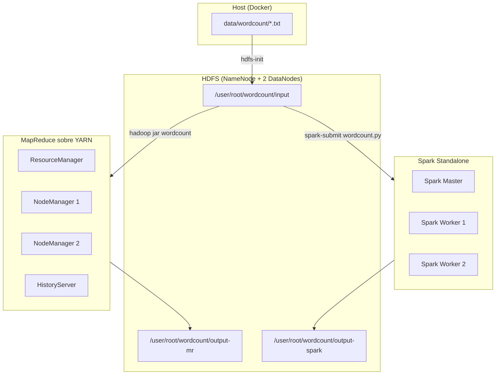

# Arquitectura del Taller 3

## Technical Summary

El entorno extiende el cluster del Taller 2 agregando un modo Spark Standalone sobre la misma red Docker. HDFS sigue siendo la capa de almacenamiento compartida: tanto el job MapReduce como el job Spark leen el input desde `hdfs://namenode:9000/user/root/wordcount/input` y escriben sus resultados en rutas distintas del mismo HDFS.

Los dos grupos de servicios son independientes en ejecucion pero comparten el mismo HDFS, lo que permite una comparacion directa sin mover datos entre sistemas.

## Diagrama de arquitectura



## Flujo de ejecucion por engine

### MapReduce (YARN)

1. El cliente envía el job al ResourceManager.
2. El ResourceManager negocia containers con los NodeManagers.
3. Cada Mapper lee un split de HDFS, emite pares `(palabra, 1)` y **escribe en disco local**.
4. La fase de shuffle ordena, agrupa y transfiere los pares al Reducer **via disco**.
5. El Reducer lee los grupos, suma los conteos y **escribe el resultado en HDFS**.
6. Todo resultado intermedio pasa por disco: esto garantiza tolerancia a fallos pero introduce latencia.

### Spark (Standalone)

1. El driver construye el DAG de operaciones: `textFile → flatMap → map → filter → reduceByKey → sortBy → saveAsTextFile`.
2. Spark divide el DAG en stages separados por shuffles.
3. Los workers ejecutan los stages manteniendo los datos **en memoria** entre transformaciones.
4. Solo el shuffle entre `reduceByKey` y `sortBy` requiere transferencia de datos entre workers.
5. El resultado final se escribe en HDFS desde los workers.

## Por que Spark es mas rapido

| Factor | MapReduce | Spark |
|--------|-----------|-------|
| Resultados intermedios | Disco local | Memoria RAM |
| Planificacion | Etapas fijas (Map → Shuffle → Reduce) | DAG optimizado |
| Evaluacion | Eager (ejecuta al enviar) | Lazy (ejecuta al necesitar el resultado) |
| Algoritmos iterativos | Lectura de HDFS en cada iteracion | Datos en cache entre iteraciones |
| Overhead de arranque | JVM del job + contenedores YARN | JVM del driver + workers ya corriendo |

Para un wordcount de pocos kilobytes la diferencia puede ser modesta porque el overhead de inicializacion de Spark es no trivial. Con datasets de gigabytes o con algoritmos que iteran sobre los mismos datos (como k-means o regresion logistica), la diferencia se vuelve ordenes de magnitud.

## Decision pedagogica: mismo dataset

Usar los mismos archivos de texto en ambos jobs es una decision deliberada. Si los datasets fueran distintos, cualquier diferencia de tiempo podria atribuirse al volumen de datos en lugar de al engine. Al usar el mismo input, la unica variable que cambia es el motor de procesamiento.

## Comparacion de codigo

### WordCount en MapReduce (Java, ~60 lineas)

```java
// Requiere tres clases: TokenizerMapper, IntSumReducer, WordCount (driver)
public class WordCount {
  public static class TokenizerMapper
      extends Mapper<Object, Text, Text, IntWritable> {
    private final static IntWritable one = new IntWritable(1);
    private Text word = new Text();
    public void map(Object key, Text value, Context context)
        throws IOException, InterruptedException {
      StringTokenizer itr = new StringTokenizer(value.toString());
      while (itr.hasMoreTokens()) {
        word.set(itr.nextToken());
        context.write(word, one);
      }
    }
  }
  public static class IntSumReducer
      extends Reducer<Text, IntWritable, Text, IntWritable> {
    private IntWritable result = new IntWritable();
    public void reduce(Text key, Iterable<IntWritable> values, Context context)
        throws IOException, InterruptedException {
      int sum = 0;
      for (IntWritable val : values) { sum += val.get(); }
      result.set(sum);
      context.write(key, result);
    }
  }
  // ... driver con configuracion del job: ~20 lineas mas
}
```

### WordCount en PySpark (~12 lineas de logica)

```python
text = spark.sparkContext.textFile(HDFS_INPUT)
counts = (
    text
    .flatMap(lambda line: line.lower().split())
    .map(lambda word: (word.strip(".,;:!?\"'()[]"), 1))
    .filter(lambda kv: len(kv[0]) > 0)
    .reduceByKey(lambda a, b: a + b)
    .sortBy(lambda kv: kv[1], ascending=False)
)
counts.map(lambda kv: f"{kv[0]}\t{kv[1]}").saveAsTextFile(HDFS_OUTPUT)
```

La reduccion en lineas de codigo refleja que Spark provee abstracciones de mas alto nivel (RDDs con transformaciones funcionales) que eliminan el boilerplate del framework MapReduce.

## Tech Stack

| Componente | Tecnologia | Version | Puerto |
|------------|-----------|---------|--------|
| Sistema de archivos distribuido | HDFS | Hadoop 3.2.1 | 9000, 9870 |
| Gestor de recursos (MR) | YARN ResourceManager | Hadoop 3.2.1 | 8088 |
| Engine batch clasico | MapReduce | Hadoop 3.2.1 | — |
| Engine batch moderno | Apache Spark | 3.5 | 8080, 7077 |
| Historial de jobs MR | JobHistory Server | Hadoop 3.2.1 | 19888 |
| Orquestacion local | Docker Compose | — | — |
| Imagen Hadoop | bde2020/hadoop-* | 2.0.0-hadoop3.2.1-java8 | — |
| Imagen Spark | bitnami/spark | 3.5 | — |
