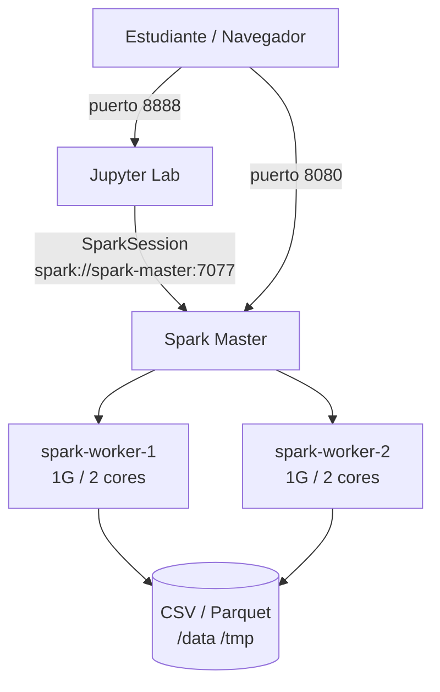

# Arquitectura — Taller 4: Spark con Datos Estructurados

## Technical Summary

El cluster usa **Spark en modo Standalone** (sin YARN ni Kubernetes). Un nodo master
coordina dos workers. El estudiante interactua a traves de **Jupyter Lab**, que corre
en un contenedor separado con PySpark preinstalado.

No hay HDFS en este taller. Los datos se montan como **bind mounts de Docker**
(directorios locales del host mapeados dentro de los contenedores). Esto simplifica
la infraestructura y permite enfocarse en la API de DataFrames.

## Diagrama de componentes



**Flujo de datos:**

```
ventas.csv (bind mount /data)
    → spark.read.csv(inferSchema=True)
    → DataFrame API (transformaciones)
    → df.write.parquet("/tmp/ventas_parquet")
    → spark.read.parquet(...)
    → createOrReplaceTempView("ventas")
    → spark.sql("SELECT ...")
```

## Decisiones de diseno

### Por que sin HDFS

Los talleres 2 y 3 ya presentaron HDFS con detalle. Mantenerlo en el Taller 4
obligaria a los estudiantes a gestionar `hdfs dfs -put` antes de poder escribir
una sola linea de PySpark. El objetivo pedagogico de este taller es la **DataFrame
API y Parquet**, no el sistema de archivos distribuido.

El Taller 5 retoma el tema de storage con **MinIO** (object storage compatible con
S3) e introduce los **Open Table Formats** (Apache Iceberg).

### Por que Jupyter

Jupyter Lab permite ejecutar celdas de forma incremental, ver el schema del
DataFrame, inspeccionar el plan de ejecucion con `df.explain()` y comparar
resultados paso a paso. Es el entorno natural para explorar datos estructurados
de forma interactiva antes de formalizar un job de produccion.

### Por que Parquet

Parquet es el formato columnar mas usado en lakes de datos (AWS S3 + Athena,
GCS + BigQuery, Azure ADLS + Synapse). Aprender a escribir y leer Parquet con
Spark es una habilidad directamente transferible a entornos de produccion.

## Tech Stack

| Componente | Version / Imagen | Rol |
|---|---|---|
| Docker / Compose | >= 24 | Orquestacion local |
| Apache Spark | 3.5 (bitnami/spark) | Motor de procesamiento |
| PySpark | 3.5 | API Python para Spark |
| Jupyter Lab | jupyter/pyspark-notebook:spark-3.5.0 | Interfaz interactiva |
| Apache Parquet | (incluido en Spark) | Formato columnar de persistencia |

## Puertos expuestos

| Puerto | Servicio | URL |
|---|---|---|
| 8080 | Spark Master UI | http://localhost:8080 |
| 7077 | Spark Master RPC | spark://localhost:7077 |
| 8888 | Jupyter Lab | http://localhost:8888 |
