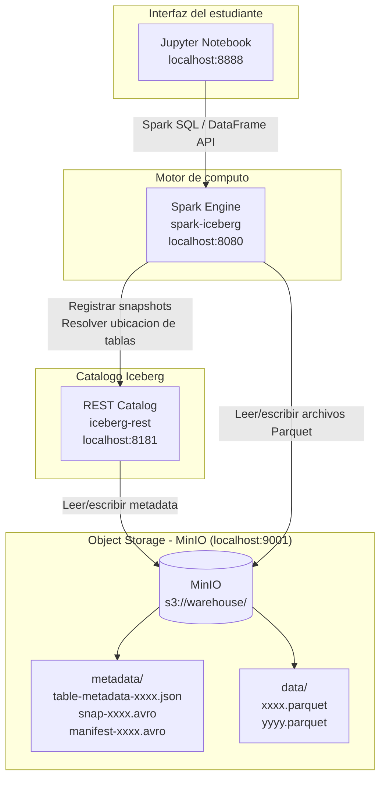

# Arquitectura: Taller 5 — MinIO + Spark + Iceberg

## Technical Summary

Este taller despliega un stack de cuatro servicios Docker que representan los componentes fundamentales de un lakehouse moderno basado en open table formats:

| Componente | Imagen Docker | Rol |
|-----------|--------------|-----|
| **MinIO** | `minio/minio:RELEASE.2024-01-16T16-07-38Z` | Object storage S3-compatible (datos + metadatos Iceberg) |
| **Iceberg REST Catalog** | `tabulario/iceberg-rest:0.10.0` | Catalogo central: gestiona snapshots y ubicacion de tablas |
| **Spark + Iceberg** | `tabulario/spark-iceberg:3.5.1_1.5.2` | Motor de procesamiento; ejecuta DML sobre tablas Iceberg |
| **Jupyter** | (incluido en spark-iceberg) | Interfaz interactiva para el estudiante |

---

## Diagrama de arquitectura



**Flujo de una escritura:**
1. El estudiante ejecuta `writeTo("demo.taller5.ventas").create()` en Jupyter
2. Spark escribe los datos como archivos **Parquet** en `s3://warehouse/taller5/ventas/data/`
3. Iceberg crea archivos de **metadata** (manifest list + manifests) en `s3://warehouse/taller5/ventas/metadata/`
4. El catalogo REST registra el **nuevo snapshot** como el estado actual de la tabla
5. Futuras lecturas preguntan al catalogo cual es el snapshot actual y leen solo los archivos relevantes

---

## Las tres capas de Iceberg

### Capa 1: Catalogo (iceberg-rest)

El catalogo es la fuente de verdad sobre **que tablas existen** y **cual es su snapshot actual**. Cuando Spark quiere leer `demo.taller5.ventas`, primero consulta el catalogo para obtener el puntero al archivo de metadata mas reciente.

Sin un catalogo, multiples escritores no podrian coordinarse para garantizar atomicidad.

### Capa 2: Metadata layer

Los archivos de metadata viven en `s3://warehouse/<namespace>/<tabla>/metadata/` y tienen la siguiente jerarquia:

```
metadata/
├── v1.metadata.json          ← Table metadata: schema, propiedades, lista de snapshots
├── v2.metadata.json          ← Nueva version tras el primer UPDATE
├── snap-<id>-1.avro          ← Manifest list: apunta a los manifests de este snapshot
└── <uuid>-m0.avro            ← Manifest file: lista de archivos Parquet con estadisticas
```

**Manifest files** contienen, por cada archivo de datos: ruta, numero de filas, estadisticas de columnas (min/max por columna). Esto permite a Iceberg hacer **partition pruning** y **predicate pushdown** sin abrir los archivos Parquet.

### Capa 3: Data layer

Los archivos Parquet en `s3://warehouse/<namespace>/<tabla>/data/` son archivos Parquet estandar. Iceberg no modifica el formato de datos — la magia esta en los metadatos.

Cuando se hace un `UPDATE`:
- Las filas modificadas se escriben en un **nuevo archivo Parquet**
- El nuevo snapshot apunta a: los archivos viejos (sin cambios) + el nuevo archivo
- Los archivos viejos **no se borran** (hasta que se ejecute `EXPIRE SNAPSHOTS`)

---

## Decisiones de diseno pedagogico

### Por que MinIO en vez de HDFS

Los talleres anteriores (2 y 3) usaron HDFS porque es el sistema de almacenamiento natural del ecosistema Hadoop/Spark clasico. Sin embargo, en el mundo real de 2024, la mayoria de los lakehouses modernos corren sobre **object storage en la nube** (AWS S3, GCS, Azure ADLS).

MinIO permite:
1. **Simular S3 localmente** con la misma API — el codigo que funciona aqui funciona en AWS sin cambios en la logica
2. **Visualizar los archivos** a traves de la consola web (localhost:9001), lo cual es pedagogicamente valioso para entender la estructura interna de Iceberg
3. **Preparar el Taller 6** donde Trino tambien se conecta a MinIO como si fuera S3

### Por que el catalogo REST en vez de Hive Metastore

El catalogo REST de Iceberg es mas ligero y moderno que Hive Metastore. Es el catalogo recomendado para nuevos despliegues y es el que usa Trino en el Taller 6. Usar el mismo catalogo en ambos talleres garantiza continuidad.

### Por que Spark 3.5 + Iceberg 1.5

- Spark 3.5 soporta DML completo (UPDATE, DELETE, MERGE INTO) sobre tablas Iceberg con la extension `IcebergSparkSessionExtensions`
- Iceberg 1.5 incluye mejoras en Schema Evolution y en la API del catalogo REST
- La imagen `tabulario/spark-iceberg:3.5.1_1.5.2` viene preconfigurada con todos los JARs necesarios

---

## Tech Stack

| Capa | Tecnologia | Version | Funcion |
|------|-----------|---------|---------|
| Orquestacion | Docker Compose | v3.8 | Levantar todos los servicios con un comando |
| Object Storage | MinIO | RELEASE.2024-01-16 | Almacenamiento S3-compatible local |
| Table Format | Apache Iceberg | 1.5.2 | Open table format (ACID, time travel, schema evolution) |
| Catalogo | Iceberg REST Catalog | 0.10.0 | Gestion de namespaces y snapshots |
| Motor de computo | Apache Spark | 3.5.1 | Ejecucion de SQL y DataFrames sobre tablas Iceberg |
| Interfaz | Jupyter Notebook | — | Entorno interactivo para el estudiante |
| Formato de datos | Apache Parquet | — | Almacenamiento columnar eficiente (capa fisica) |

---

## Puertos expuestos

| Puerto | Servicio | URL |
|--------|---------|-----|
| 8888 | Jupyter Notebook | http://localhost:8888 |
| 8080 | Spark UI | http://localhost:8080 |
| 9000 | MinIO API (S3) | http://localhost:9000 |
| 9001 | MinIO Console | http://localhost:9001 |
| 8181 | Iceberg REST Catalog | http://localhost:8181 |
