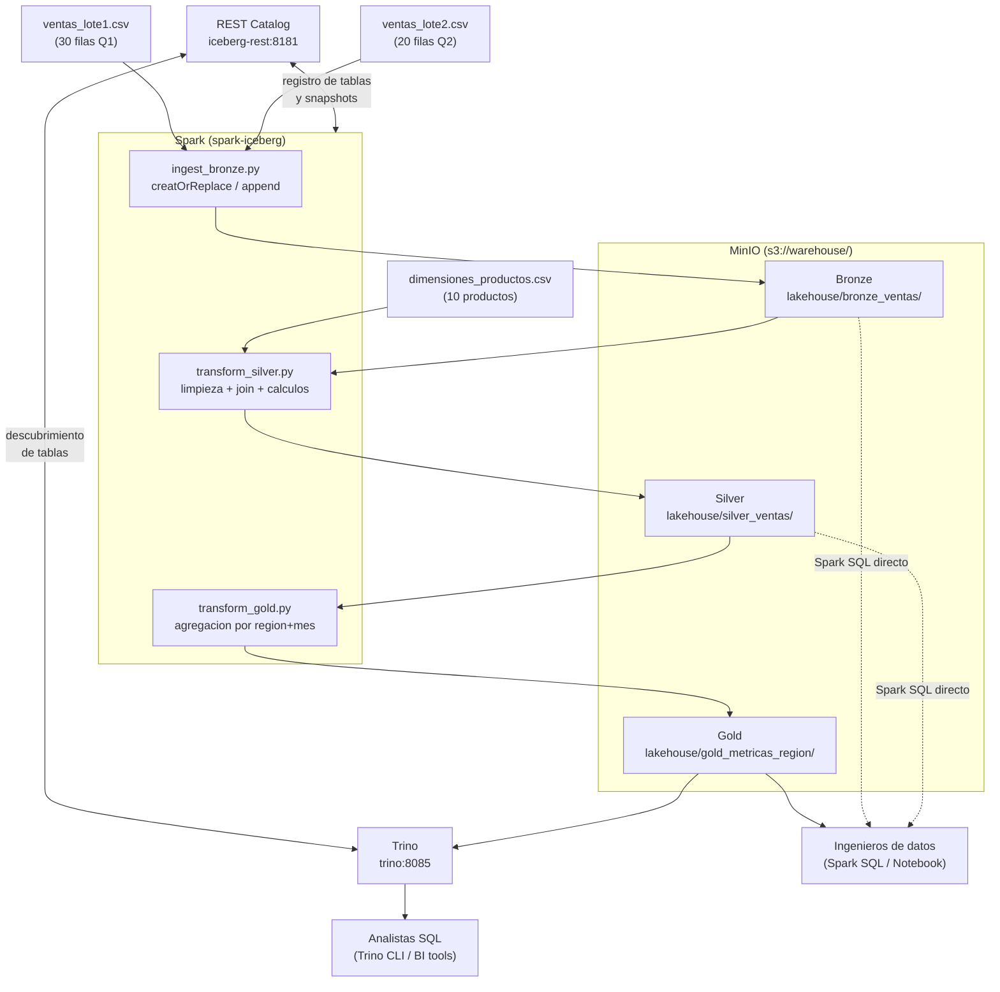

# Arquitectura del Taller 6: Lakehouse completo

## Diagrama de flujo

## Por que el catalogo compartido es la pieza clave

Sin un catalogo compartido, Spark y Trino tendrian que coordinar de forma manual:
- Spark escribe archivos Parquet en MinIO.
- Alguien tendria que decirle a Trino: "los archivos estan en esta ruta, con este esquema".
- Si Spark actualiza los datos, Trino no lo sabe a menos que se actualice manualmente la definicion.

Con el **catalogo REST de Iceberg**:
- Spark registra cada tabla (y cada snapshot) en el catalogo al momento de escribir.
- Trino consulta el catalogo para obtener la ubicacion exacta y el esquema actual.
- No hay sincronizacion manual. Ambos motores ven exactamente la misma version de los datos.

Esto es equivalente a lo que hace el Hive Metastore en arquitecturas on-premise, pero usando un protocolo REST estandar que no depende de Hadoop.

## Comparacion con arquitectura on-premise HDFS

| Aspecto               | On-premise (T2/T3)         | Lakehouse (T6)                   |
|-----------------------|----------------------------|----------------------------------|
| Storage               | HDFS (bloques replicados)  | MinIO / S3 (objetos)             |
| Formato               | Text, Parquet              | Iceberg sobre Parquet            |
| Catalogo              | Hive Metastore             | Iceberg REST Catalog             |
| Transacciones ACID    | No (sin Iceberg)           | Si (Iceberg)                     |
| Versionado            | No                         | Si (snapshots)                   |
| Multi-engine          | Solo Hive/Spark            | Spark + Trino + Flink (y mas)    |
| Escalabilidad storage | Limitado al cluster        | Virtualmente ilimitado           |
| Costo storage         | Alto (hardware dedicado)   | Bajo (commodity / cloud)         |

## Tech Stack

| Componente       | Imagen Docker                              | Puerto | Rol                              |
|------------------|--------------------------------------------|--------|----------------------------------|
| MinIO            | minio/minio:RELEASE.2024-01-16T16-07-38Z   | 9000/9001 | Object storage (S3 compatible) |
| mc               | minio/mc:RELEASE.2024-01-16T02-49-20Z      | —      | Setup inicial de buckets         |
| Iceberg REST     | tabulario/iceberg-rest:0.10.0              | 8181   | Catalogo compartido Spark+Trino  |
| Spark + Iceberg  | tabulario/spark-iceberg:3.5.1_1.5.2        | 8888/8080 | Procesamiento ETL              |
| Trino            | trinodb/trino:435                          | 8085   | Query engine SQL para analistas  |

## Principios de diseno

### Separacion de responsabilidades entre capas

Cada capa tiene contratos distintos con sus consumidores:

- **Bronze** garantiza: "estos son exactamente los datos que llegaron, sin modificar".
- **Silver** garantiza: "estos datos son validos, completos y enriquecidos con dimensiones".
- **Gold** garantiza: "estas metricas son correctas y estan listas para consumo analitico".

Si un analista encuentra un numero incorrecto en Gold, el equipo de ingenieria puede:
1. Verificar Silver para ver si el dato de transaccion estaba mal.
2. Verificar Bronze para ver si el dato crudo estaba mal desde la fuente.
3. Re-ejecutar solo el stage necesario (Silver o Gold) sin re-ingestar.

### Compute vs Storage

En la arquitectura HDFS tradicional, el compute y el storage estan acoplados: el cluster Hadoop
almacena los datos Y los procesa. Esto significa que escalar storage implica comprar mas nodos
de computo (y viceversa).

En el Lakehouse, MinIO gestiona el storage de forma independiente. Se puede:
- Escalar el cluster de Spark sin tocar MinIO.
- Apagar Spark fuera del horario de procesamiento sin afectar los datos almacenados.
- Agregar Trino como motor de consulta sin necesitar mas storage.

Esta separacion es la razon por la que el Lakehouse domina en entornos cloud.
